# Service-Computing-selpg
## Introduction
本次实验主要依据[开发Linux命令行实用设计](https://www.baidu.com/link?url=cZY9FB2KYWGpDO5e3q2g3ID_OjMUf6AmMXQv6wrCkgvnkJfCqWuKTpS006K8xMULpT7Y3w8Ioy2cHJNno0BbM7rFiMWj0YYDBo64cTQSUpi&wd=&eqid=e6888680000049ff0000000659e4723f)用golang开发selpg的小工具。selpg主要能够根据用户指定的合法页码进行打印。
### selpg命令的基本参数和可选参数
-sSNumber：指定打印的起始页，例如-s10即从第10页开始打印

-eENumber：指定打印的结束页，例如-e20即打印到20页就结束

-dDestination：指定打印机的位置，在本实验中利用其他子进程代替

-lLNum：确定打印的每页有固定的行数并说明有多少行，例如-l3即每页有3行

-f：确定打印的每页行数不固定

其中-s，-e都是必选的参数，其余可选。

如果没有-d则默认将输出打印到终端。

-l和-f参数有冲突，如果没有-l和-f，则默认有固定行数的页。
如果有-f，则认为每页没有固定长度，按'\f'分隔页。如果有'-l'但没有指定长度，则默认行数为72。

## Preparation
### IO
var fin *bufio.Reader

fin = bufio.NewReader(?)

当？是os.Stdin时从终端接收输入；
当？是指定的文件时从文件读入输入

var fout *bufio.Writer

fout = bufio.NewWriter(?)

当？是os.Stdout时输出到终端；
当？是指定的文件时，输出到文件。文件不存在时创建文件并输入。

打开文件准备读入

var f *os.File

f, err = os.Open(filename)

按行读入输入

crc,err := fin.ReadString('\n')

按字符读入

c, _, err := fin.ReadRune()

写入字符串

fout.WriteString(crc)

fout.Flush()

### strconv

字符串转数字

i,err := strconv.Atoi(s1[2:len(s1)])

数字转字符串

strconv.Itoa(i)

### os/exec
创建新进程

another := exec.Command("cat","-n")

创建输入管道

in,_ := another.StdinPipe()

输入的内容

in.Write([]byte(your_string))

开始新进程

in.Close()

another.Stdout = os.Stdout

another.Start()

### flag
定义参数变量
	var filename string
	
	var num int
	
	flag.StringVar(&filename,"n","input_file","The name of the input file. Defaults to input_file.")
	
	flag.IntVar(&num,"c",100,"The num of character. Defaults to 100.")
	
	flag.Parse()
	
以上要求命令有如下形式 command -n=yr_filename -c=99

如果没有，则对两个参数赋缺省值

如果有其他参数可以通过flag.Args()访问

### generateInput.go,outputstring.go
#### generateInput.go
生成input1_file，每行用'/f'结尾

./generateInput -n=input1_file -t=0

生成input2_file，每行用'/n'结尾

./generateInput -n=input2_file -t=1

#### outputstring.go
接受任意输入，并输出
	
## Test
1. $ selpg -s10 -e20 input_file
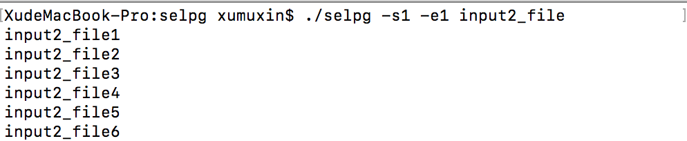
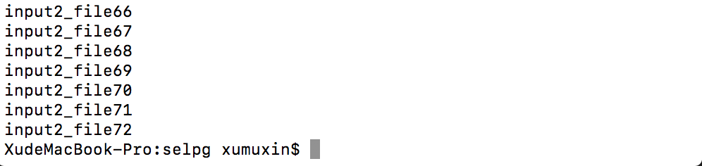selpg从固定文件读取输入并输出到终端，由于没有指定行号，默认72行一页，结果如图。
2. $ selpg -s10 -e20 < input_file
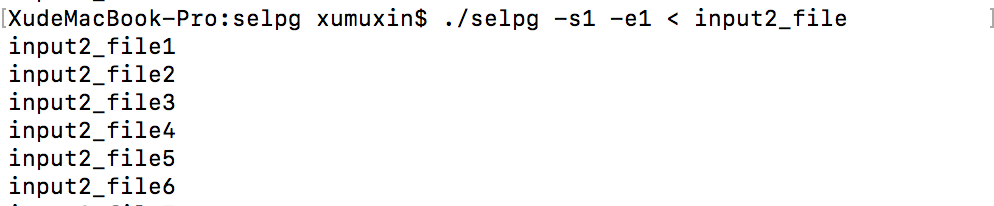
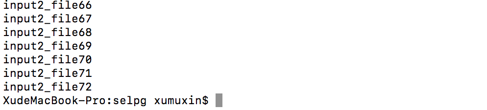
从Stdin读取输入并输出到终端，结果如图。
3. $ other_command | selpg -s10 -e20
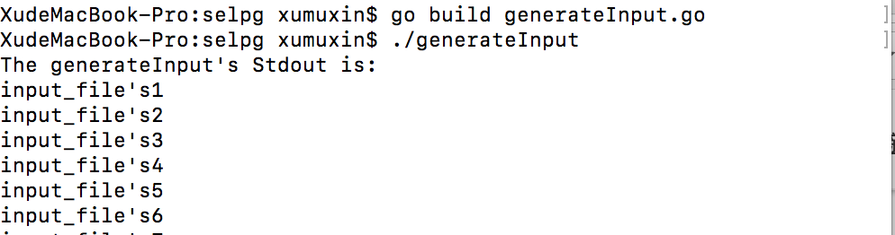
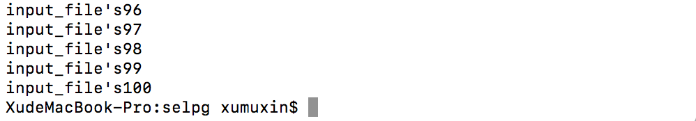
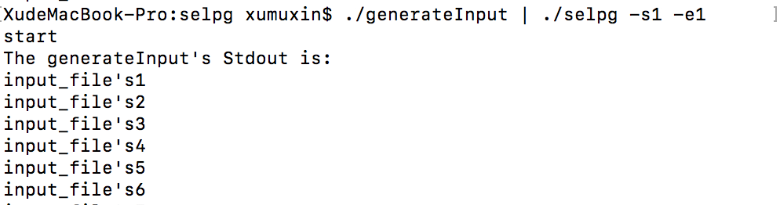
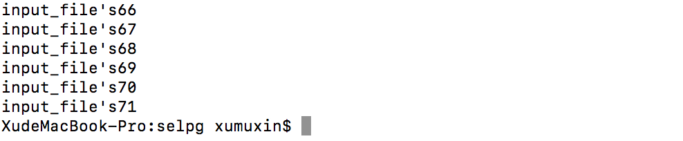
generateInput的Stdout如图所示，它的Stdout经过|会变成selpg的Stdin，由于两个程序的功能都是输出到终端，为了区别我让selpg打印多一句输出"start"，结果如图。
4. $ selpg -s10 -e20 input_file >output_file
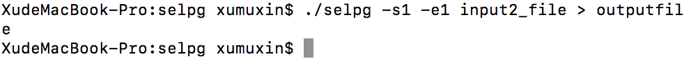
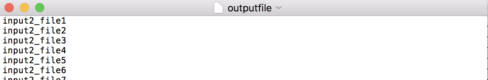
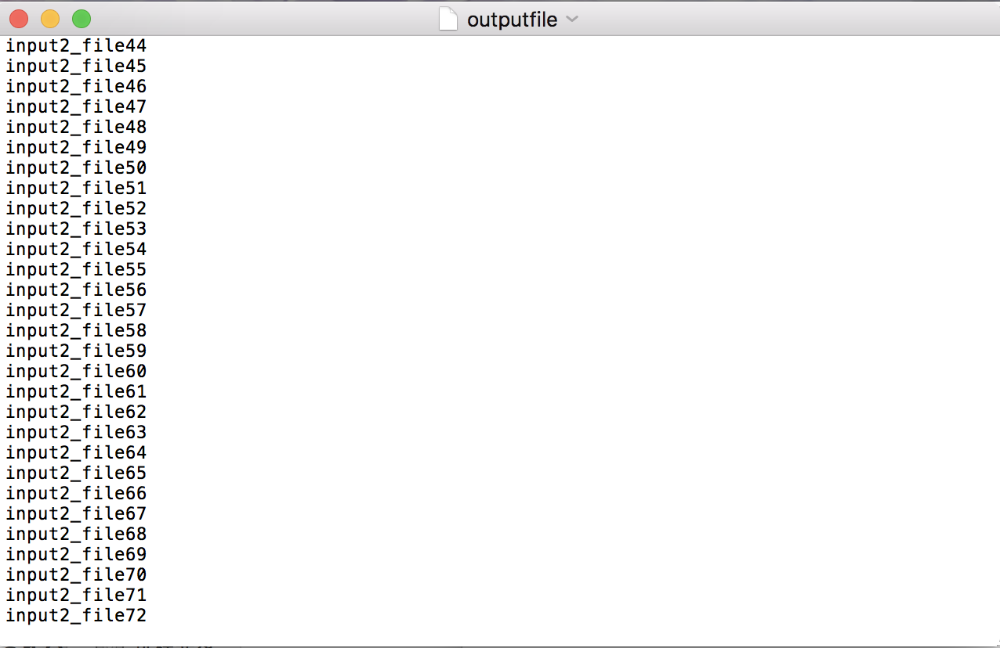
selpg的Stdin打印输出到output_file，Stdout没内容，结果如图。
5. $ selpg -s10 -e20 input_file 2>error_file
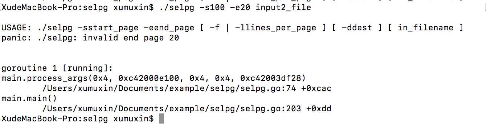
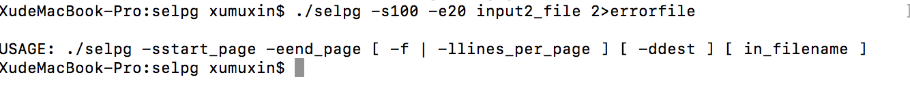
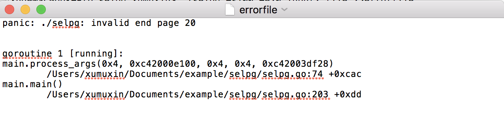错误信息不输出到终端，直接打印到error_file，结果如图。
6. $ selpg -s10 -e20 input_file >output_file 2>error_file
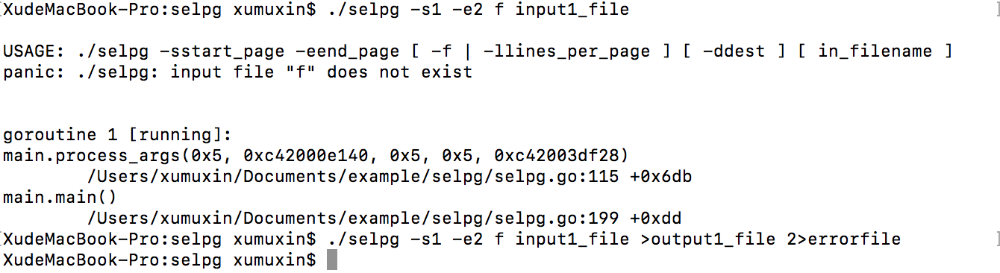
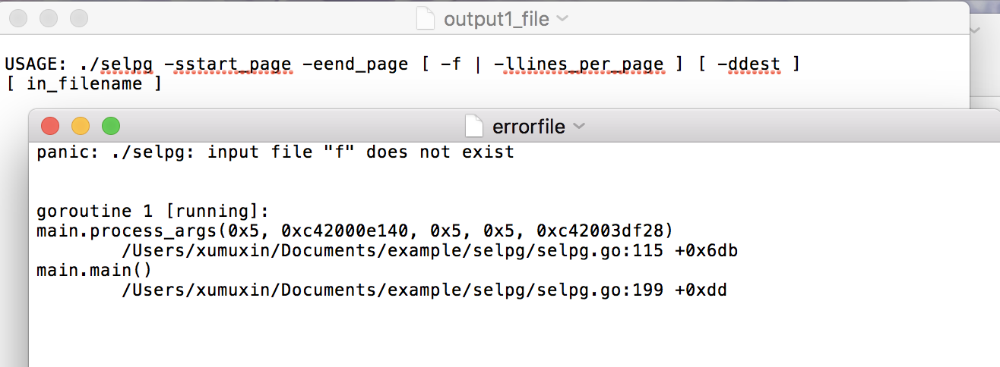
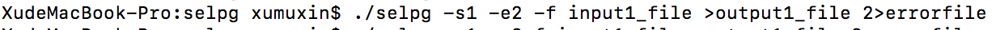
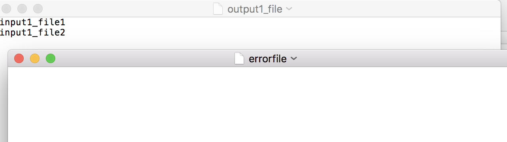当有错误时，output_file只会存储非错误的输出部分，而错误会由error_file存储，当没有错误时，error_file自然为空，结果如图。
7. $ selpg -s10 -e20 input_file >output_file 2>/dev/null
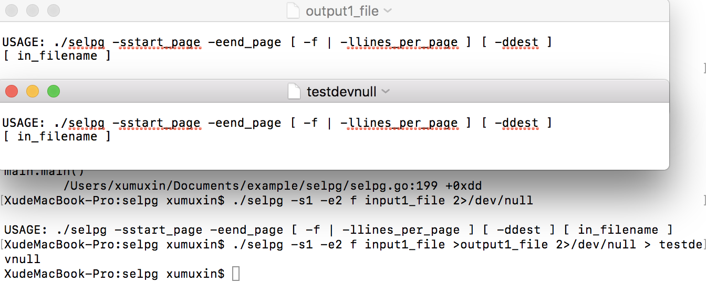Stdout，output_file,testdevnull里面都没有显示错误信息，证明错误信息被丢弃，结果如图。
8. $ selpg -s10 -e20 input_file >/dev/null
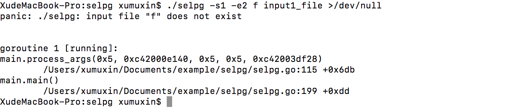在其他的测试例子里，即使错误也会输出usage，但是这里明显只输出了错误，结果如图。
9. $ selpg -s10 -e20 input_file | other_command
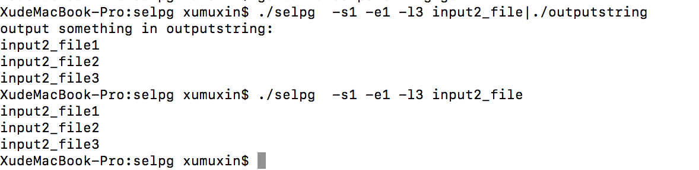
input2_file中的内容经过selpg打印到Stdout，再变为outputstring的Stdin，outputstring将Stdin打印出来，为了区别，outputstring每次会打印一句固定输出，结果如图。
10. $ selpg -s10 -e20 input_file 2>error_file | other_command
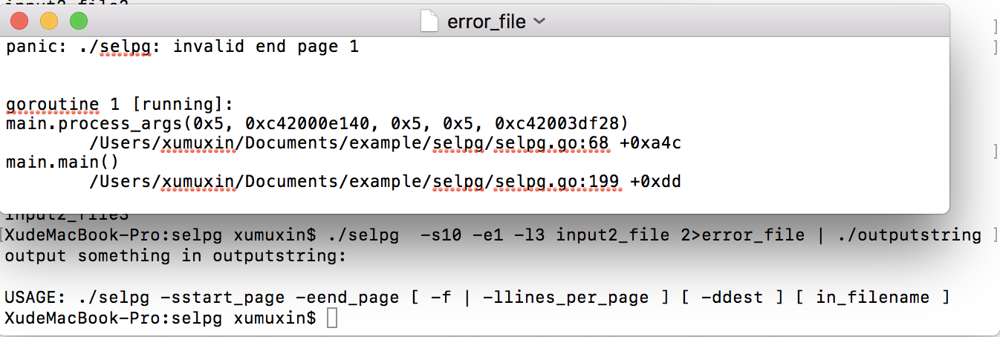从图中可以发现other_command的输入为空所以它的输出只有一句固定的输出，error_file中存储了错误的原因，结果如图。
11. $selpg -s10 -e20 -dlp input2_file 
由于没有打印机，用os/exec生成的子进程cat，-n模拟，生成的效果位为每行输入添加行号，结果如图。
